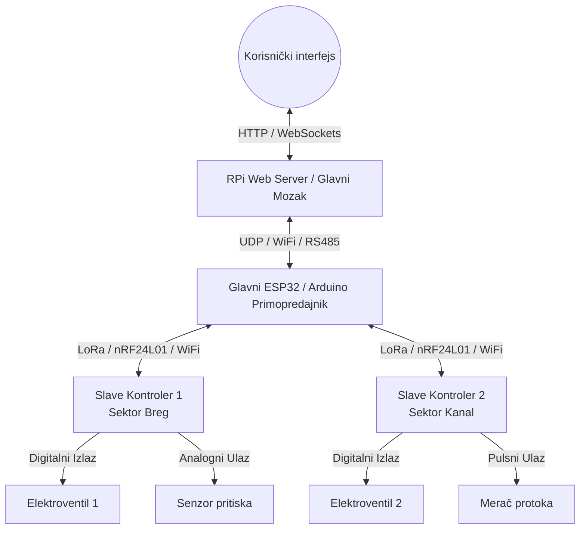

# Plan i Arhitektura Upravljačke Elektronike (Master / Slave)

Ovaj dokument opisuje celokupan plan povezivanja, mrežnih protokola i interaktivnog mapiranja pinova za naš pametni sistem navodnjavanja.

---

## 1. Topologija i Komunikacija

Sistem se sastoji od **Glavnog kontrolera (Master/Glavni mozak)** i **udaljenih kontrolera (Slave/Podkontroleri)** postavljenih direktno na parcelama.



### Tipovi uređaja:
1. **Glavni mozak (Master)**:
   * Radi na **Raspberry Pi** (gde se izvršava i naš web server) ili na posebnom **ESP32** koji preko mreže prima instrukcije.
   * On sinhronizuje rad svih sekcija, prati bezbednosne parametre i izdaje komande podkontrolerima.
2. **Slave kontroleri (Slave/Sub)**:
   * Distribuirani čvorovi na njivama (obično jeftini **ESP32**, **ESP8266** ili **Arduino** ploče sa bežičnim modulom).
   * Spajaju se direktno na elektroventile, pumpe, merače pritiska i protoka na licu mesta.

---

## 2. Model Podataka (Bez Hardkodovanja)

Kako bismo ispoštovali **pravilo zabrane hardkodovanja**, podaci o uređajima i njihovim fizičkim pinovima se čuvaju u `konfiguracija.json` pod ključem `devices`.

### Primer strukture uređaja u JSON-u:
```json
{
  "devices": [
    {
      "id": "dev_master_01",
      "type": "master_controller",
      "name": "Glavni Mozak RPi",
      "ip_address": "192.168.1.100",
      "port": 8888,
      "protocol": "UDP",
      "lat": 45.6125,
      "lon": 20.5781,
      "pins": [
        {"pin_num": 4, "type": "OUTPUT", "assigned_to": "pump_01", "label": "Glavna pumpa", "status": 0},
        {"pin_num": 17, "type": "INPUT_PULLUP", "assigned_to": "flow_01", "label": "Merač protoka", "status": 0}
      ]
    },
    {
      "id": "dev_slave_01",
      "type": "slave_controller",
      "name": "Slave Breg (ESP32)",
      "ip_address": "192.168.1.101",
      "port": 8888,
      "protocol": "LoRa_CH_2",
      "lat": 45.6086,
      "lon": 20.5704,
      "pins": [
        {"pin_num": 12, "type": "OUTPUT", "assigned_to": "valve_178142", "label": "Ventil Breg Istok", "status": 0},
        {"pin_num": 13, "type": "OUTPUT", "assigned_to": "valve_178143", "label": "Ventil Breg Zapad", "status": 0},
        {"pin_num": 34, "type": "ANALOG_INPUT", "assigned_to": "gauge_01", "label": "Senzor pritiska", "status": 412}
      ]
    }
  ]
}
```

> [!TIP]
> **Labavo povezivanje (Loose Coupling)**: Na mapi iscrtavamo fiktivne elektroventile i pumpe kao vizuelne elemente, a u podešavanjima kontrolera ih jednostavnim izborom spajamo sa konkretnim pinom na kontroleru!

---

## 3. UI/UX Koncept (Korisnički Modal)

Klikom na kontroler (Master/Slave) na mapi, otvoriće se interaktivni modal sa sledećim tabovima:

### 📡 1. Mrežna podešavanja
* Slobodan unos naziva kontrolera.
* Izbor protokola (UDP, TCP, RS485, LoRa).
* Unos IP adrese, porta ili LoRa ID kanala.
* Status veze (Ping / Last Seen indikator).

### 🔌 2. Mapiranje pinova (IO pinovi)
Tabela svih raspoloživih pinova na izabranom čipu:
1. **Pin #**: Fizički pin (GPIO2, GPIO12, A0...).
2. **Režim (Mode)**: Padajući meni (`OUTPUT`, `INPUT_PULLUP`, `ANALOG_INPUT`, `DISABLED`).
3. **Povezani element**: Dinamički padajući meni koji skenira sve iscrtane elemente sa mape (ventile, pumpe, merače) i omogućava nam da povežemo npr. *Pin 12 sa ventilom "Breg Istok"*.
4. **Oznaka**: Slobodan opis pina (npr. *"Glavni ventil za voćnjak"*).

### 🛠️ 3. Dijagnostika i Ručna kontrola
* Nivo signala (RSSI) i procenat baterije (ako je bežični čvor).
* Tasteri za ručno testiranje (forsiranje otvaranja/zatvaranja pojedinačnih pinova radi provere ispravnosti elektroventila direktno sa telefona ili računara na njivi).
